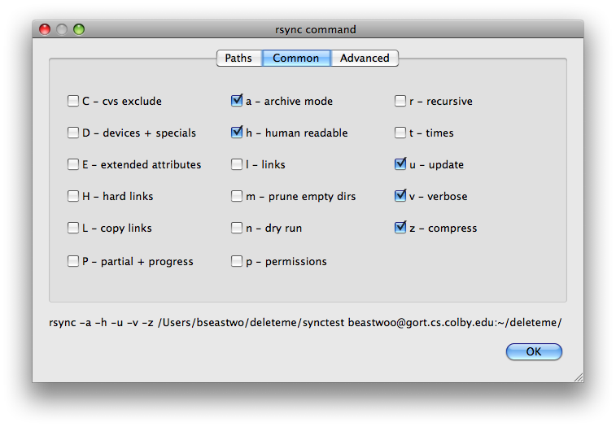
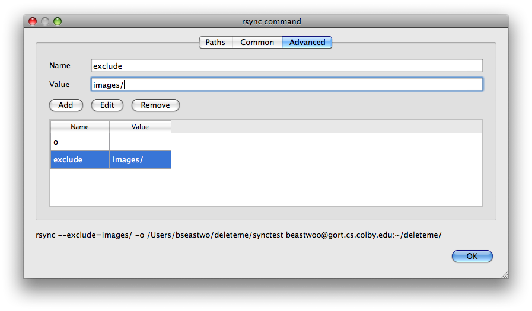

.. index:: command configuration

Commands
========

Synctity manages and executes :command:`rsync` commands, which are configured by the :guilabel:`rsync command` dialog.  This dialog can be launched from the :guilabel:`Edit Profile` section of the Synctity main by double-clicking on any existing command or adding a new command.  Each command specifies a file copying operation.

The :guilabel:`rsync command` dialog is split into three tabs, :guilabel:`Paths`, :guilabel:`Common`, and :guilabel:`Advanced`.  The :guilabel:`Paths` tab configures the files involved in the file copying operation, while the other two tabs configure options related to the file transfer.  The :command:`rsync` command that is being configured is displayed in text at the bottom of the dialog.

Paths
-----

The :guilabel:`Paths` tab configures the :guilabel:`Source` and :guilabel:`Destination` of a file copy operation.  When executed, files are copied from the source location to the destination location.

.. note::

	On Unix-based machines, folders are files.  So, in this documentation, the term "file" means either a file or a folder.

Either one (but not both) of the source and destination paths can be located on a remote file system.  A complete path consists of three components:

Path
	The absolute path to a file, local to the machine where the file resides.  That is, the path from the root of the file system to the file.  *This is required*.  The ``~`` character can be used to denote the user's home directory.
	
	This can be entered manually in the :guilabel:`Path` text box or from a file browser by clicking on the :guilabel:`...` button next to the text box.
	
Host
	The name of the machine where the file resides.  This can be an IP address or a machine name known on the network.  *This is optional*; by default, the local machine is assumed.

User
	The name of a user who has access to the file through SSH authorization.  *This is required if Host is specified*.
	
These components combine to form a complete network path with the format ``user@host:/path``.  The path that the :command:`rsync` command will use can be seen at the bottom of the :guilabel:`rsync command` dialog.
	
.. seealso::

	In order to use remote a remote file system you must have :doc:`sshauth` configured.

The :command:`rsync` program makes an important distinction between source paths that end with the ``/`` directory delimiter and those that do not.  If the source folder does not specify a trailing ``/``, the entire folder is copied to the destination location.  If a trailing ``/`` is specified, the *contents* of the folder are copied to the destination location.

For example, given the following source and destination file system::

    $ tree
    .
    ├── source
    │   └── teapot.txt
    └── target

If we specified a source path of ``source``, the file system would look like this after synchroniziation::

    $ tree
    .
    ├── source
    │   └── teapot.txt
    └── target
        └── source
            └── teapot.txt
			
If, however, we specified a source path of ``source/``, the file system would look like this after synchronization::

    $ tree
    .
    ├── source
    │   └── teapot.txt
    └── target
        └── teapot.txt

:command:`rsync` does not make the same distinction for the destination directory.  In Synctity, however, collections of :command:`rsync` commands can be run in reverse, where the source and destination directories are swapped.  This is something to keep in mind when configuring paths.

Common Options
--------------

.. sidebar:: Option Overload
	
	The sheer number of options available is what makes :command:`rsync` somewhat difficult to use in practice.  This is the point of the :guilabel:`Common` tab---present the commonly-used options with brief descriptions to make it easy to find and use the options that are right for a particular task.

:command:`rsync` has a large number of parameters that influence how files are copied from the source to destination.  The :guilabel:`Common` tab collects the most commonly-used options in a single view.  All of the options on this tab are turned on and off by toggling a check box---none of the options have parameters.  Each option has a single letter code and short description.  Hovering the mouse over an option will display a more detailed description.  When an option is enabled, it will appear in the command line text at the bottom of the :guilabel:`rsync command` dialog.

.. seealso::

	You may still need to consult the `rsync documentation <http://www.samba.org/ftp/rsync/rsync.html>`_ from time to time.

Advanced Options
----------------

There are yet more options in :command:`rsync`, and some of these require parameter values, and therefore cannot be configured with a simple check box.  The :guilabel:`Advanced` tab provides a means to configure any :command:`rsync` parameter by specifying a name/value pair.

Use the following controls to add, edit, or remove advanced options:

Name
	The name of the option, as known by :command:`rsync`.  This can be a single-letter option, such as ``o`` or a named option, such as ``exclude``.  *This is required*.  Do not use a leading dash (``-`` or ``--``) when specifying option names---this will be added as appropriate.
	
Value
	The value to supply for the option.  *This is optional*.
	
Add
	Adds the option specified by the name/value pair to the :command:`rsync` command.  The new option will be displayed in the table and in the command text.
	
Edit
	Updates the option currently selected in the table with the name/value pair specified in the :guilabel:`Name` and :guilabel:`Value` text boxes.

Remove
	Removes the option currently selected in the table from the command.
	
Name/Value Table
	This table displays the currently configured options.  Selecting an option will populate the :guilabel:`Name` and :guilabel:`Value` text boxes.

For example, below is a command that is configured to preserve file ownership attributes (``-o``) and exclude directories called ``images`` (``--exclude=images/``):

