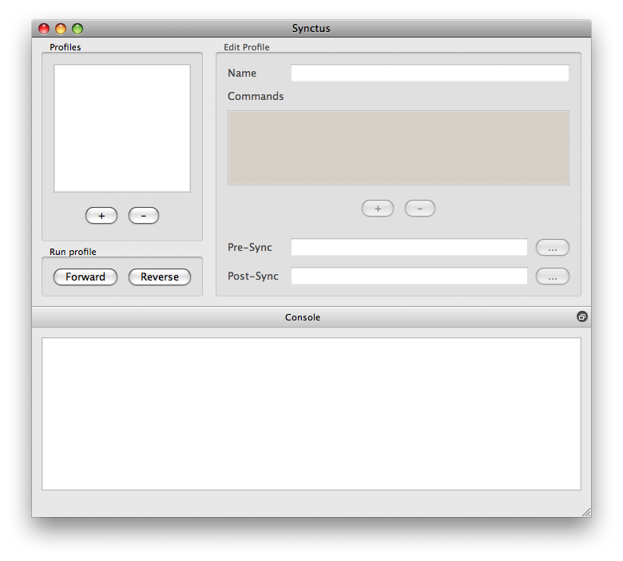
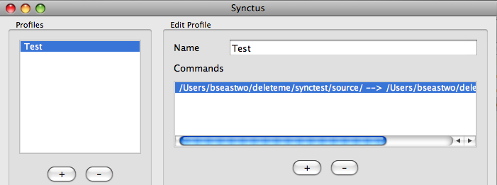

.. index:: quick start
.. index:: introduction

Getting Started
===============

This introduction provides a quick tutorial to getting started using Synctity for synchronizing file systems.  This assumes that you have successfully installed Synctity on your computer.

.. seealso::
  	See the :doc:`installation` page to get the program up and running.

Before starting Synctity, you need some files to synchronize.  Create or find some source files you want to use to test synchronization and an empty destination directory where you want the synchronized files to be copied.  As an example, assume we have the following directory structure::

    $ tree -D
    .
    ├── [Aug  5 22:55]  source
    │   └── [Aug  5 23:42]  teapot.txt
    └── [Aug  6 16:48]  target

When you launch Synctity for the first time, you will see a screen that looks like the screen shot below.  There are three main sections of the Synctity window, labled :guilabel:`Profiles`, :guilabel:`Edit Profiles`, and :guilabel:`Console`.

Click on the :guilabel:`+` button in the :guilabel:`Profiles` section to add a new synchronization profile.  The profile name in the :guilabel:`Edit Profile` section is immediately selected; rename the profile, e.g. 'Test'.

Click on the :guilabel:`+` button in the :guilabel:`Edit Profiles` section for the new Test profile.  A dialog titled :guilabel:`rsync command` will appear prompting for source and destination paths.  Select the source and target directories configured above, and add a '/' to the end of each :guilabel:`Path`.  

Select the :guilabel:`Common` tab on the command dialog, and check the boxes :guilabel:`a`, :guilabel:`h`, :guilabel:`u`, and :guilabel:`v`.  Uncheck the box :guilabel:`n`.  After this is complete, the text at the bottom of the dialog will look like the following::

	rsync -a -h -u -v /Users/bseastwo/deleteme/synctest/source/ /Users/bseastwo/deleteme/synctest/target/

Click the :guilabel:`OK` button.  The top of the Synctity main window will look like this:

Click on the :guilabel:`Forward` button under the :guilabel:`Run Profiles` label.  The following text will appear in the :guilabel:`Console` window::

	rsync -a -h -u -v /Users/bseastwo/deleteme/synctest/source/ /Users/bseastwo/deleteme/synctest/target/
	building file list ... done
	./
	teapot.txt
	
	sent 158 bytes  received 48 bytes  412.00 bytes/sec
	total size is 21  speedup is 0.10
	
	Finished (0)

The directories are now synchronized, as can be confirmed::

    $ tree -D
    .
    ├── [Aug  5 22:55]  source
    │   └── [Aug  5 23:42]  teapot.txt
    └── [Aug  5 22:55]  target
        └── [Aug  5 23:42]  teapot.txt

Try changing some of the files in the source directory and rerunning the synchronization.  If a file is unchanged from one synchronization to the next, it will not be copied.  This synchronization can be run forward and backward.